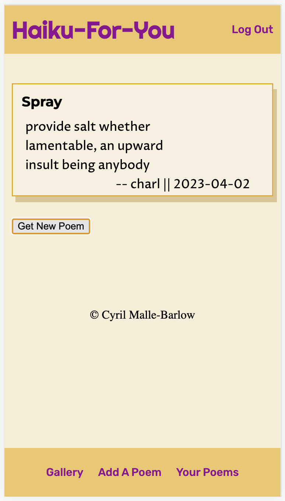
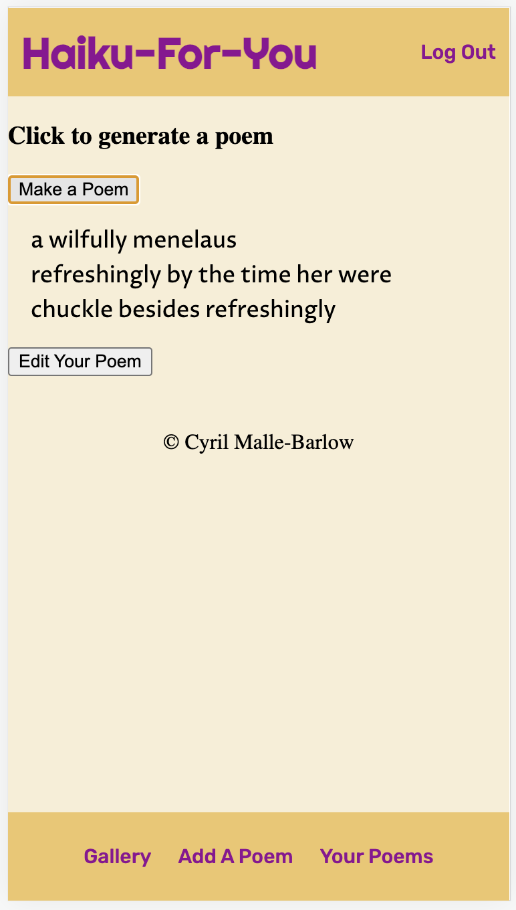
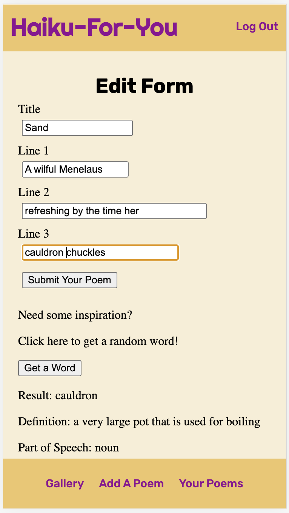
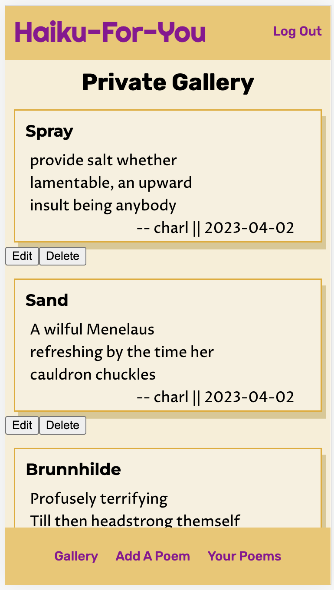

# Haiku-For-You

## Description

Haiku-For-You removes the stress of authorship from the creative process by generating a random haiku which users can edit and publish in a public gallery. The generated poem does not adhere to the strict syllable format of haiku (fun over form here), but tries to follow the short-long-short, three line structure. Poetry can be fun and daring, [take the plunge!](https://arcane-depths-36312.herokuapp.com/)

## Preview

| :---: |
| Home |
| The home page displays a random poem from the database, providing users a quick poetry-getaway. |
|  |

| Making a Poem |
| Here users can generate a random haiku. The app assembles a skeleton of grammar using some cascading logic, then pulls random words by their part of speech and inserts them in the appropriate place. Nouns, adjectives, verbs and adverbs are called from the Words API, the other parts of speech are drawn from the app's database. |
|  |

| Edit Your Poem |
| When the user is satisfied with their random poem, they enter the editing phase. They can add a title and punctuation, and restructure their poem for more meaning or absurdity. If they get stuck, they can get a random word from the app to inspire new images or feelings. |
|  |

| Publishing the Poem |
| Once the user likes their poem, they can submit it to be displayed in the public gallery for all users to see. They can also sort to see only the poem they have submitted, where they find the options to further edit or delete their works. |
|  |

## Technologies

- JavaScript
- HTML
- CSS
- React
- Redux
- Redux-Saga
- Axios.js
- Node.js
- Express
- PostgreSQL
- Postico2
- Postman
- Words API

## Acknowledgments

I want to thank Prime Digital Academy, the amazing Amethyst cohort, and my loved ones, who remind me to find seeds in the weird of words.

## Contact

I'd love to hear any feedback or insights, connect with me here!

